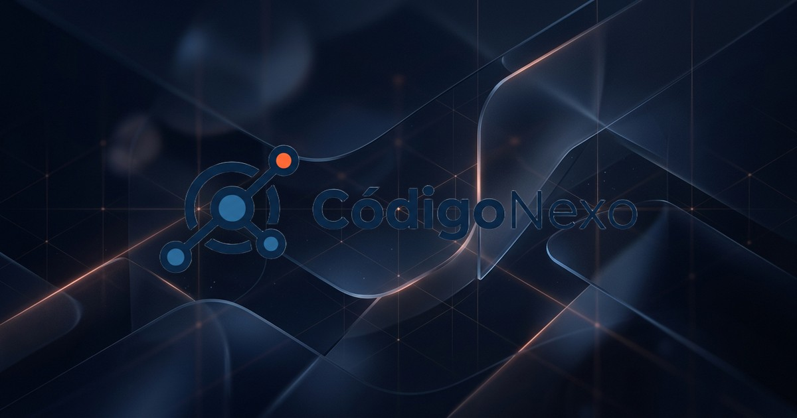

# CódigoNexo - Soluciones Digitales



Proyecto web premium corporativo para **CódigoNexo**, una consultora especializada en soluciones digitales, plataformas de capacitación y desarrollo a la medida. 

Esta arquitectura ha sido minuciosamente pulida para competir estéticamente y en rendimiento con empresas top-tier de la industria del software.

## 🚀 Objetivo del Proyecto
Crear una carta de presentación digital que refleje **excelencia en ingeniería, modernidad y fiabilidad**. El proyecto se aleja de una web corporativa tradicional para abrazar el minimalismo, micro-interacciones táctiles y velocidades de carga instantáneas.

## 🛠️ Tecnologías Utilizadas
- **HTML5 Semántico**: Accesibilidad nativa y etiquetas optimizadas.
- **CSS3 Moderno**: CSS Grid, Flexbox, Variables Nativas (Custom Properties), `clamp()` tipográfico, `100dvh`, Micro-interacciones físicas (cubic-bezier).
- **Vanilla JavaScript ES6**: Manejo del DOM eficiente y asíncrono, sin dependencias, ni frameworks pesados (0 KB de carga extra).
- **Optimización de Medios**: Formato `.webp`, Font-icons y SVGs.

## 📁 Estructura del Proyecto
El ecosistema sigue un estándar modular y escalable:
```text
/codigonexo
├── index.html                   # Entry point semántico (~600 líneas)
├── README.md                    # Documentación
├── CHANGELOG.md                 # Historial de versiones y fases
├── .gitignore                   # Exclusiones de repo
└── assets/
    ├── css/
    │   └── style.css            # Hoja de estilos principal con tokens premium
    ├── js/
    │   └── main.js              # Lógica asíncrona de UI y modales
    └── images/
        └── [recursos .webp, .png y SVGs optimizados]
```

## ⚙️ Instalación y Ejecución Local
Dado que es una arquitectura sin build-step, la ejecución es inmediata:

1. Clona el repositorio:
   ```bash
   git clone https://github.com/su-voz-a-diario/codigonexo.git
   ```
2. Ejecuta un servidor local:
   ```bash
   # Opción 1: Python
   python3 -m http.server 8080
   
   # Opción 2: Node.js (requiere live-server)
   npx live-server
   ```
3. Visita `http://localhost:8080`.

## 🚀 Despliegue
El proyecto está optimizado como *Static Site* (Sitio Estático). 
Es compatible con despliegues directos en:
- **GitHub Pages**
- **Vercel**
- **Netlify**
- **Cloudflare Pages**

*No se requiere proceso de compilación (build).*

## 🔧 Mantenibilidad y Estilos (Tokens)
La hoja de estilos está centralizada en variables de raíz (`:root`). Para modificar el branding o escalamiento:
1. Abre `assets/css/style.css`
2. Modifica el diccionario superior (ej. `--azul-oscuro`, `--naranja-cta`, `--borde-radius`).
Toda la interfaz responderá en cascada manteniendo los contrastes y las micro-interacciones.

## 📦 Dependencias Remotas
- **Google Fonts (Inter y Montserrat):** Cargados de forma pre-conectada (`preconnect`) para máxima eficiencia.
- No existen librerías de JS externas como jQuery o Bootstrap. Todo el DOM está gestionado en Vainilla JS.

---
*Desarrollado y optimizado por el ecosistema de automatización Antigravity en 2026.*
